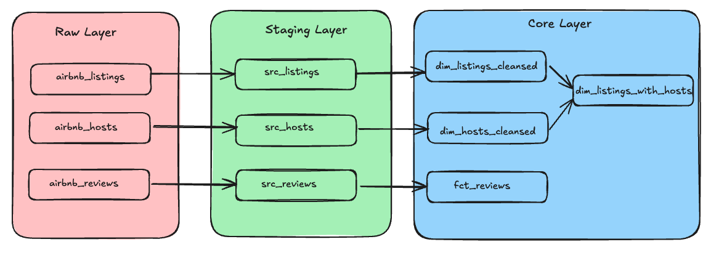

Welcome to your new dbt project!

### Using the starter project

Try running the following commands:
- dbt run
- dbt test

### Resources:
- Learn more about dbt [in the docs](https://docs.getdbt.com/docs/introduction)
- Check out [Discourse](https://discourse.getdbt.com/) for commonly asked questions and answers
- Join the [chat](https://community.getdbt.com/) on Slack for live discussions and support
- Find [dbt events](https://events.getdbt.com) near you
- Check out [the blog](https://blog.getdbt.com/) for the latest news on dbt's development and best practices

### Source files for the project
- The dlt pipeline in the utils folder is used to insert the data to the data warehouse
 * https://dbtlearn.s3.amazonaws.com/hosts.csv
 * https://dbtlearn.s3.amazonaws.com/reviews.csv
 * https://dbtlearn.s3.amazonaws.com/listings.csv

### Inserting csv content to the warehouse
- The dlt pipeline in the utils folder is used to insert the data to the data warehouse
- The pipeline reads the csv files from the source_files folder and inserts the data to the warehouse

### source file to DB Warehouse 
- hosts.csv --> airbnb_hosts
- reviews.csv --> airbnb_reviews
- listings.csv --> airbnb_listings

### Data Modeling

### First Model creation
- The first sets of models are created on top of the source tables created using the csv file
- The models are materialized as view
- Model Mapping
   - airbnb_hosts -> raw_hosts
   - airbnb_reviews -> raw_reviews
   - airbnb_listings -> raw_listings
- The models are created in the models/src folder

### Creating dimension models
- The dimension models are created on top of the raw models
- The dimension models are materialized as view
- Model Mapping
- src_listings --> dim_listings_cleansed
   - Model Name : `dim_listings_cleansed.sql`
   - Few Data cleansing is also done as part of the model creation
      - because of the data irregularity, minimum nights can be 0 or 1. The minimum nights are set to 1 as part of data cleansing
      - In the src table price per night is a string value with a `$` added to the numeric value. As part of cleansing the `$` sign is removed and data is converted to `NUMERIC` value
- src_hosts --> dim_hosts_cleansed  
   - Model Name : `dim_hosts_cleansed.sql`
   - Data cleansing : to make sure all the record's host_name column is not null, we have used the `COALESCE` function to set the value as `Anonymous` if the `NULL`
